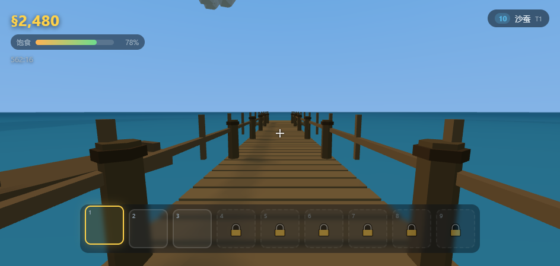
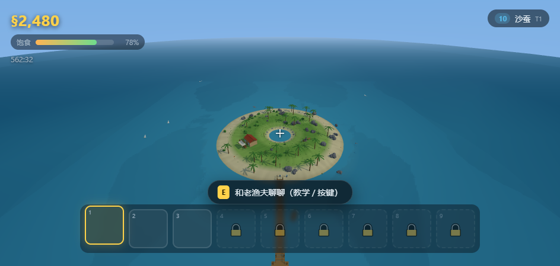

# 去钓鱼 · GotoFish

**在线直接玩：<https://yanyue33.github.io/GotoFish/>**

一款**低多边形 3D 海岛钓鱼休闲游戏**。开局一无所有，在海滩上捡贝壳海螺攒钱，
买钓竿、买鱼饵，钓遍从螃蟹龙虾到月光锦鲤的 34 种鱼，烤鱼卖钱，把喜欢的鱼养在岛中央的鱼池里。

[](https://yanyue33.github.io/GotoFish/)
[](#验证与测试)
[](vendor/README.md)
[](LICENSE)





- **零构建、零运行时依赖**：纯 ES Module + WebGL，`vendor/` 里只有一份 three.js（r169）。
- **零外部资源**：地形、角色、鱼、道具、图标全部由代码程序化生成，音效由 WebAudio 现场合成。
  整个游戏只有文本文件，没有一张图片、一个音频文件。
- **104 个逻辑单元测试 + 12 项启动冒烟检查 + 99 项真实浏览器端到端检查**，全部可通过
  `npm run verify` 一键复现。

---

## 快速开始

```bash
node tools/serve.mjs          # 或 npm start
# 浏览器打开 http://127.0.0.1:5178/
```

> 必须用 HTTP 打开。直接双击 `index.html`（`file://`）会因为浏览器的 ES Module
> 同源策略而加载失败，这是浏览器的限制，不是游戏的问题。

需要一个支持 **WebGL2** 的现代浏览器（Chrome / Edge / Firefox / Safari 16+）。

### 验证与测试

```bash
npm test          # 104 个逻辑单元测试（纯 Node，不需要浏览器）
npm run check     # 静态自检：模块图、import/export 一致性、循环依赖、资源引用
npm run test:boot # 12 项启动冒烟检查：用真实浏览器打开 index.html 并点进游戏
npm run test:e2e  # 99 项端到端检查：在浏览器里真的开一局，钓一条鱼、烤一条鱼
npm run test:single # 18 项单文件离线版验收：file:// 下真的能玩、真的零网络请求
npm run balance   # 数值平衡模拟：把每一档竿/饵/钓点的收益与回本时间打印成表
npm run verify    # 上面这些一起跑
```

无头测试会自己找浏览器（Playwright 缓存 / Chrome / Edge），也可以用
`GOTOFISH_BROWSER=<路径> npm run test:e2e` 指定。

想手动看一眼某个场景，可以借截图模式（会顺便验证渲染没坏）：

```bash
GOTOFISH_PAGE=/tools/shot.html GOTOFISH_SHOT_VIEW=orbit GOTOFISH_SCREENSHOT=shot.png npm run test:e2e
# SHOT_VIEW 可选：pier / island / shop / pond / orbit
```

---

## 玩法

### 核心循环

```
捡海产品 → 卖给商店老板 → 买钓竿 & 鱼饵 → 钓鱼 → 卖钱 / 烤了吃 / 养进鱼池
   ↑                                                        ↓
   └──────────────── 更高级的竿 → 更深的海 → 更贵的鱼 ←────────┘
```

### 设计要点

| 系统 | 说明 |
| --- | --- |
| **海产品** | 岛上会持续刷新 10 种海产品（海带、蛤蜊、海螺…… 到珍珠），沙滩和水边最多。开局全靠捡。 |
| **钓竿** | 6 级（竹制手竿 → 深海传说·龙王竿）。等级决定**能钓到的鱼的等级上限**，同时影响收线力度、鱼线强度、稀有度加成。 |
| **钓点** | 近岸（+0 级）、木栈桥（+1）、礁石外海（+2）。也就是说 T1 的竹竿到栈桥也能碰到 T2 的鱼。深水还会让鱼咬钩更慢。 |
| **鱼饵** | 6 级，单独占一格且可堆叠。**饵等级必须 ≥ 鱼的等级**，否则权重按等级差指数衰减（不是完全钓不到，但会等到怀疑人生）。越好的饵咬钩越快、稀有鱼概率越高、越耐用。每次抛竿按概率消耗一个。 |
| **34 种鱼** | 6 个等级，每级 5~6 种，**每级正好 1 条特殊鱼**：石斑鱼、真鲷、蓝鳍金枪王、黄金鬼头刀、幽灵鳐、月光锦鲤。特殊鱼在满配下也只有约 1.5% 出现率，价值是同级的 8 倍以上。 |
| **鱼的属性** | 品质（破损/普通/优良/完美/传说）、重量、尺寸。三者都影响价格，而且**等级越高的鱼对属性越敏感**——这就是后期一条鱼能卖到十万的原因。 |
| **烧烤** | 找阿炭花 60 元点火（烧 3 分钟）。鱼放上去烤：8 秒半熟 → **18 秒「刚好好」价值 ×2.35** → 34 秒偏老 → 48 秒开始烤焦 → 78 秒成焦炭（几乎一文不值）。面板只给火候阶段和一根会变色的条，不给准确秒数。烤过的鱼还能放回去继续烤。 |
| **饱食度** | 会随时间下降（走路掉得快）。低于 25% 移动速度线性变慢。吃海产品或鱼回复，**烤过的回复更多**（×1.8）。 |
| **背包** | 开局 3 格，最多 9 格，扩容价 800 → 3000 → …… → 120000。一格一件（鱼不堆叠），所以格子是真的紧张。鱼饵另占一格。 |
| **鱼池** | 岛中央的观赏鱼池，最多 60 条。放进去的鱼会**真的在水里游**（3D），可以随时捞回来或直接卖给商店。 |
| **商店** | 老陈的杂货铺。钓竿和鱼饵**直接摆在室外货架上**，走近按 E 就能买；和他本人交互则是完整的买卖面板（含背包扩容、一键全卖、卖出确认）。 |
| **统计面板** | V 键。累计收支、钓鱼次数、跑鱼数、稀有鱼数量、单条最重/最贵、等级分布、图鉴进度、最近 20 次渔获明细（含钓点、品质、重量、尺寸、价值）。 |

### 难度曲线（数值自检）

单元测试会守住这些不变量，改数值时不会悄悄写坏：

- 每级中位价值严格递增（13 → 62 → 218 → 990 → 3800 → 12000）。
- 每级特殊鱼 ≥ 同级普通鱼上限的 8 倍。
- 品质倍率单调：0.45 / 1.0 / 1.65 / 2.9 / 6.0。
- 低级竿**永远**钓不出传说品质；满级竿出传说约 6%。
- 1 级饵几乎钓不到 5 级以上鱼（<5%）；饵等级越高，平均鱼等级越高。
- 火候价值曲线在「刚好好」处达到唯一峰值，之后单调下降。
- 钓竿/鱼饵的商店回收价低于买入价（不能套利）。

`npm run balance` 会把整条曲线真的跑一遍（每档配置 4000 次抛竿）并打印成表，
改完数值可以直接看手感对不对。当前的设计目标与实测：

| 阶段 | 每次抛竿净收益 | 换下一根竿需要 |
| --- | --- | --- |
| T1 竹竿 · 近岸 | ~11 元 | ~16 次（第一根竿只要 180 元） |
| T2 玻璃钢 · 栈桥 | ~110 元 | ~11 次 |
| T3 碳素矶竿 · 栈桥 | ~441 元 | ~14 次 |
| T4 船钓竿 · 栈桥 | ~1,838 元 | ~16 次 |
| T5 钛合金 · 栈桥 | ~9,888 元 | ~13 次 |
| T6 龙王竿 · 栈桥 | ~25,527 元 | — （顶级） |

也就是说：**每一级钓竿大约需要十几到二十几次成功的抛竿**，
真实节奏还要加上走路、卖货、烤鱼、捡海产品的时间，所以每一档都够玩一会儿，
但也不会卡到让人想放弃。

### 操作

| 按键 | 作用 |
| --- | --- |
| `W A S D` | 前后左右移动 |
| `Shift` | 冲刺 |
| `鼠标` | 视角（点击画布锁定鼠标） |
| `鼠标滚轮` / `1`~`9` | 切换手持物品 |
| `鼠标左键` | 手持钓竿：**按住蓄力，松开抛竿**（按得越久抛得越远）；鱼咬钩时点一下提竿；搏斗时**按住收线**。手持海产品/鱼：按住进食 |
| `鼠标右键` | 快速收竿（放弃/收线中断） |
| `E` | 交互：买货架上的商品、和 NPC 交易、捡地上的东西、查看鱼池、用烧烤架 |
| `X` | 把手上的东西放到地上 |
| `B` | 切换鱼饵（在背包里的鱼饵之间轮换） |
| `F` | 检视手持物品（品质/重量/尺寸/**价值拆解**） |
| `V` | 统计面板 |
| `C` | 第一 / 第三人称切换 |
| `H` | 帮助（教学 + 按键一览） |
| `P` | 切换帧率显示 |
| `Esc` | 设置 / 暂停 |

#### 钓鱼的操作细节

1. 选中钓竿，**按住左键**蓄力（地面会出现白圈提示落点，可在设置里关掉）。
2. **松开左键**抛竿，钩子抛物线飞出去落水。
3. 等鱼咬钩——浮标会猛地一沉，屏幕提示「咬钩了！」，你只有 **1.35 秒**点左键提竿。
4. 进入搏斗：**按住左键收线**，但下面的**鱼线张力条**会涨。
   - 张力进入黄区（>0.72）就该准备了，进红区（>1.0）还硬拉，每秒都有概率**断线**或**脱钩**。
   - 松手张力会回落，但鱼会拉走一点进度。
   - 鱼有自己的挣扎节奏（周期性的强弱变化），所以不是无脑一按一松就完事。
5. 进度条满 → 鱼进背包。背包满了会自动掉在脚下（不会凭空消失）。

#### 前期怎么起步

1. 一开始出生在岛南边的沙滩，往海边走走，地上就有海带、蛤蜊、海虹；按 `E` 捡。
2. 背包只有 3 格，捡满就去找商店老板老陈（岛西北角，红色屋顶的小屋）卖掉。
3. 攒到 120 元买一根竹制手竿，再花 8 元买 10 个沙蚕。
4. 选中钓竿，对着海按住左键蓄力抛出去，等浮标沉下去。
5. 钓上来的螃蟹龙虾直接卖，或者拿去烧烤架烤了吃/卖更多钱。

---

## 分享给别人玩

这游戏的代码是 ES Module，浏览器**不允许**在 `file://` 下加载模块，所以直接发
`index.html` 给别人、让他双击，是打不开的。下面几种方式按省事程度排序：

### 方式一：发一个单文件 HTML（最省事，推荐）

```bash
npm run build:single
# 生成 dist/去钓鱼.html（约 2 MB，gzip 后 543 KB）
```

把这个文件发给任何人，**对方双击就能玩，不需要装任何东西、不需要服务器、完全离线**
（除了 three.js 之外所有资源都在文件里，连 CSS 都是内联的）。

原理：把每个模块的源码变成一个 Blob URL（与文档同源，可以互相 import），
模块之间的 import 说明符在打包时换成占位符、在运行时按依赖顺序回填成真实的 Blob URL。
因为静态 import 的说明符必须是字符串字面量，所以用「占位符 + 依赖序回填」而不是函数调用。
详见 `tools/build-single.mjs` 顶部的注释。

> 单文件版的存档写在浏览器里（`localStorage`）。个别浏览器禁止 `file://` 页面写本地存储，
> 这种情况下游戏会照常运行，只是进度只在本次游戏内有效 —— 页面左下角会明确提示。

### 方式二：打包成 zip（解压后自己起服务 / 上传托管）

```bash
npm run build:zip
# 生成 dist/去钓鱼-web版.zip（约 365 KB，解压 1.6 MB，26 个文件）
```

zip 里包含运行必需的文件 + 一份 `怎么打开.txt` + `启动本地服务器.mjs`。
适合「扔进群文件」「拷 U 盘」「上传到任意静态托管」。

### 方式三：丢到静态托管，发个链接（最像"发布"）

这个项目**不需要构建步骤**，纯静态文件，所以任何静态托管都能直接用：

| 平台 | 做法 |
| --- | --- |
| **GitHub Pages** | **本项目已经配好了**：<https://yanyue33.github.io/GotoFish/> 。换仓库的话：Settings → Pages → Source 选 `main` 分支根目录。注意 GitHub Free 只能在<u>公开仓库</u>上开 Pages |
| **Netlify Drop** | 打开 [app.netlify.com/drop](https://app.netlify.com/drop)，把整个项目文件夹拖进去，立刻得到一个网址（不用注册也能先试） |
| **Cloudflare Pages / Vercel** | 连 Git 仓库，Build command 留空，Output directory 填 `/`（或项目根） |
| **itch.io** | 新建项目 → Kind 选 HTML → 把项目文件打成 zip 上传 → 勾选 "This file will be played in the browser" |

> 注意：`dist/`、`build/`、`tests/`、`tools/`、`docs/` 都不是运行必需的，
> 上传时只传 `index.html`、`styles/`、`src/`、`vendor/` 就够（就是 zip 里的那套）。

### 方式四：同一个 Wi-Fi 下的朋友直接连你的电脑

```bash
node tools/serve.mjs 5178 0.0.0.0
```

启动后终端会打印你的局域网地址（例如 `http://192.168.1.23:5178/`），
把这个地址发给同一个 Wi-Fi 下的手机 / 电脑，打开就能玩。关掉终端就结束。

### 发给别人时的注意事项

- **必须支持 WebGL2**：Chrome / Edge / Firefox / Safari 16+ 都行；很老的浏览器或
  关掉了硬件加速的环境可能起不来（游戏会显示「启动失败」并给出原因）。
- **手机上能开但没做触屏操作**：目前只做了鼠标键盘，手机打开只能看画面。
  窄屏下 HUD 会自适应，但没有虚拟摇杆。
- **存档是浏览器本地的**：换浏览器、换设备、清缓存都会丢，也不会在玩家之间同步。

---

## 项目结构

```
index.html              入口（importmap + HUD/面板的 DOM 骨架）
styles/main.css         全部样式
vendor/three.module.js  three.js r169（唯一第三方依赖，本地副本）
src/
  game.js               主控：把渲染、世界、玩家、系统、UI 串起来
  core/
    rng.js              可注入种子的随机数与数学工具（测试可复现的关键）
    format.js           数字/重量/长度/时间的显示格式化
    emitter.js          极简事件总线
    state.js            全局状态：钱、饱食度、背包、鱼池、统计、存档
    settings.js         设置（鼠标灵敏度、画质档位、音量…… 独立存储键）
  data/
    fish.js             鱼/海产品/鱼饵数据表 + 全部概率与价值公式（纯函数）
    items.js            物品统一层、钓竿/钓点/商店目录、定价与火候
  systems/
    inventory.js        背包（格子、堆叠、扩容）
    fishing.js          钓鱼状态机（蓄力/飞行/等待/咬钩/搏斗/结算）
    shop.js             买卖逻辑
    grill.js            烧烤与火候
    audio.js            WebAudio 程序化音效与环境音
  world/
    models.js           低多边形模型工厂（几何体缓存 + 顶点色 + 合并）
    world.js            海岛、海水、鱼池、商店、烧烤区、栈桥、植被、天空
  player/
    controller.js       移动、视角、碰撞、手持物品挂点
  ui/
    ui.js               HUD 与全部面板
    icons.js            离屏 WebGL 图标渲染器（背包格里的图标是那件东西的模型）
tests/
  run.mjs               单元测试入口
  harness.mjs           极简测试框架（零依赖）
  items.test.mjs        数据表、品质、定价、火候、咬钩模型的测试
  state.test.mjs        背包、状态、商店、烤架、钓鱼流程的测试
  e2e.html              浏览器端到端测试场景
tools/
  serve.mjs             零依赖静态服务器（第三参数填 0.0.0.0 可给局域网玩）
  smoke.mjs             静态自检（模块图 / import-export / 循环依赖 / 资源引用）
  smoke-boot.mjs        启动冒烟：真实浏览器打开 index.html 并点进游戏
  smoke-single.mjs      单文件离线版验收：file:// 下真的能玩、真的零网络请求
  e2e.mjs               无头浏览器端到端运行器
  wsmini.mjs            自实现的极简 WebSocket + CDP 客户端（零依赖）
  shot.html             截图 / 人工巡检用的页面（自动跳过开始遮罩）
  balance.mjs           数值平衡模拟器（跑概率模型，打印收益与回本时间表）
  build-single.mjs      打包成单文件 HTML（发给别人双击即玩）
  build-zip.mjs         打包成 zip（静态托管 / 群文件分享用）
docs/                   截图
```

### 分享 / 发布相关

| 命令 | 产物 | 用途 |
| --- | --- | --- |
| `npm run build:single` | `dist/去钓鱼.html`（2 MB） | 发一个文件给朋友，双击即玩，零依赖、纯离线 |
| `npm run build:zip` | `dist/去钓鱼-web版.zip`（365 KB） | 静态托管 / 群文件 / U 盘 |
| `npm run test:single` | — | 先打包再用真实浏览器以 `file://` 验收一遍 |
| `node tools/serve.mjs 5178 0.0.0.0` | — | 起服务器给局域网里的手机 / 电脑玩 |

### 分层约定（很重要）

- `src/core`、`src/data`、`src/systems` **完全不 import three.js，也不碰 DOM**。
  所以它们可以在 Node 里直接跑单元测试，也方便以后换渲染层。
- 只有 `src/world`、`src/player`、`src/ui/icons.js`、`src/game.js` 依赖 three.js。
- 所有游戏逻辑走 `src/core/rng.js` 的随机源，测试时注入固定种子就能复现任何结果。

---

## 性能

策划里特别强调了「3D 画面一定要流畅」，所以做了这些事：

| 手段 | 效果 |
| --- | --- |
| **全场景共用一个 flat-shaded 顶点色材质** | 一整个房子、一棵树、一条鱼都是 1 个 draw call 级别的基础开销 |
| **几何体按参数签名缓存 + 合并** | 30 棵棕榈树共享同一份 buffer；每个物件只上传一次 |
| **草用 InstancedMesh** | 几百丛草 = 1 次 draw call |
| **不用贴图，只有顶点色** | 零纹理上传、零采样、零内存带宽压力 |
| **水面分两层** | 近处密网格做波浪，远处超大平面铺进雾里，避免露出「世界的直边」 |
| **离屏图标只渲染一次** | 背包格的图标取到后缓存成 dataURL，运行时不再渲染 |
| **三档画质预设** | 流畅 / 均衡 / 精细，实时切换分辨率倍率、阴影、雾距、物件数量 |
| **每帧零分配的热路径** | 鱼线顶点复用同一个 BufferAttribute；HUD 只在数值变化时写 DOM |
| **雾 + 视距裁剪** | 远处不画，海岛氛围也更好 |

实测（无头 Chromium + SwiftShader **纯软件**渲染，等于没有显卡的最坏情况）：
岛上一局约 55~125 个 draw call、1.7 万~4.2 万个三角形，960×600 下 30~45 FPS。
换算成真实 GPU 余量非常充足；设置面板里也留了「流畅」档给低端设备。

---

## 存档

- 进度自动保存在浏览器 `localStorage`（键 `gotofish.save.v1`）：金钱、饱食度、背包、
  鱼池、烤架上的鱼、掉落物、统计与渔获日志、游戏时长。
- 每 45 秒自动保存，关页面/切标签页时也会保存。设置存在另一个键（`gotofish.settings.v1`），
  所以换存档不会丢设置。
- 设置面板里有「重开新档」。存档损坏时会安全地开新档而不是崩掉（有单元测试覆盖）。

---

## 已知取舍

- **没有做实体碰撞体**：玩家与树木、建筑之间不做阻挡，靠地形高度和「水太深不能走」限制活动范围。
  休闲游戏的定位下这是可接受的取舍，换来的是零物理引擎依赖和更稳的帧率。
- **没有做船钓玩法**：钓点里的「礁石外海」是用栈桥尽头代替的，小船只是场景装饰。
- **没有做手机触屏操作**：只做了鼠标键盘。HUD 布局在窄屏下会自适应，但没做虚拟摇杆。
- **音效是合成音**：没有真实音效素材，全部用 WebAudio 振荡器 + 噪声现场合成。
- **角色没有骨骼动画**：移动是整体位移 + 头部起伏 + 手持物摆动，没有走路循环。

---

## 许可

游戏代码：MIT。
`vendor/three.module.js`：three.js 的 MIT 许可，见 `vendor/LICENSE-three.txt`。
